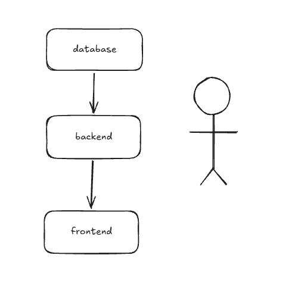

# 💱 Utilitário de Câmbio e Conversor de Moedas



Um utilitário web de conversão de moedas limpo, responsivo e baseado em Streamlit desenvolvido em Python.

Este projeto demonstra uma arquitetura modular ao desacoplar a lógica de domínio pura em Python da camada de apresentação da interface do Streamlit, permitindo testes automatizados e alta confiabilidade.

---

## 1. 👥 Título do Projeto e Membros da Equipe

- **Título do Projeto:** Utilitário de Câmbio e Conversor de Moedas
- **Membros da Equipe e Funções:**
  - **Membro 1 (Desenvolvedor Líder):** Lógica principal de domínio, integração com API de taxas de câmbio e algoritmos de normalização de taxas.
  - **Membro 2 (Engenheiro de Frontend e QA):** Design de UI/UX em Streamlit, layout de componentes e suíte de testes unitários automatizados.

---

## 2. 🎯 Declaração do Problema (Problem Statement)

Ao viajar, gerenciar transações internacionais ou planejar orçamentos entre diferentes países, as pessoas frequentemente enfrentam:
- Taxas de câmbio voláteis e cálculos de conversão confusos.
- Taxas ocultas de spread/markup cobradas por bancos, casas de câmbio e cartões de crédito (1% a 5%), dificultando a previsão do custo real final.
- Sites de conversão poluídos com anúncios pesados que falham completamente na ausência de uma conexão ativa com a internet.

**Solução:** Este utilitário fornece uma ferramenta de conversão instantânea, livre de anúncios, com simulação transparente de taxas de spread/markup, tabela de comparação simultânea entre múltiplas moedas e fallback automático para taxas salvas offline quando a conectividade com a rede é perdida.

---

## 3. 🚀 Funcionalidades Principais do MVP

- **Taxas em Tempo Real e Resiliência Offline:**
  - Taxas ao vivo obtidas a partir de APIs abertas de taxas de câmbio.
  - Fallback automático para taxas estáticas offline caso não haja conexão com a rede ou esteja em ambiente restrito.
  - Indicador visual do status das cotações (API Ao Vivo vs. Fallback Offline) e carimbo de data/hora da última atualização.
- **Conversão Interativa de Moedas:**
  - Conversão de valores entre mais de 20 moedas globais (USD, EUR, GBP, JPY, BRL, VND, CAD, AUD, etc.).
  - **Inversão Rápida de Moedas (`⇄`)** com apenas um clique entre a moeda de origem e destino.
  - Formatação inteligente de casas decimais (2 casas para moedas tradicionais como USD/EUR/BRL; 0 casas para moedas como JPY/KRW/VND).
- **Calculadora de Taxa de Câmbio / Spread (Markup):**
  - Controle deslizante ajustável (0% a 5%) simulando tarifas bancárias, de balcão ou cartões de crédito.
  - Detalhamento transparente exibindo o valor bruto convertido, a taxa deduzida e o valor líquido recebido.
- **Painel de Comparação Multimoedas:**
  - Visualização simultânea da conversão do valor de entrada em mais de 15 moedas globais em uma tabela organizada.
- **Histórico da Sessão:**
  - Mantém o registro das conversões recentes realizadas durante a sessão ativa, com opção de limpar o histórico.

---

## 4. 📊 Esquema de Dados (Data Schema)

A aplicação estrutura os dados de conversão e cotações em dicionários JSON limpos e serializáveis:

### Esquema do Resultado da Conversão (`convert()`)
```json
{
  "amount": 100.0,
  "from_currency": "USD",
  "to_currency": "EUR",
  "unit_rate": 0.92,
  "inverse_rate": 1.087,
  "raw_amount": 92.0,
  "fee_percent": 2.0,
  "fee_amount": 1.84,
  "net_amount": 90.16
}
```

### Esquema de Resposta de Taxas (`fetch_rates()`)
```json
{
  "base": "USD",
  "last_updated": "Wed, 16 Sep 2026 00:00:01 +0000",
  "is_live": true,
  "rates": {
    "USD": 1.0,
    "EUR": 0.92,
    "GBP": 0.78,
    "JPY": 155.0,
    "BRL": 5.45,
    "VND": 25400.0
  }
}
```

---

## 5. 🧪 Alvos de Testes Unitários (3+ Metas)

A suíte de testes automatizados (`test_converter.py`) valida a lógica de negócios central cobrindo os seguintes alvos:

1. **Exatidão dos Cálculos de Câmbio e Taxas Cruzadas:**
   - Valida conversões de identidade (`USD -> USD = 1.0`).
   - Valida conversões diretas de pares (`USD -> EUR`).
   - Valida triangulações sintéticas entre moedas cruzadas (`EUR -> JPY` através da proporção das taxas base).
2. **Matemática de Taxas e Spread (Markup):**
   - Garante a precisão do cálculo do valor bruto convertido, dedução de taxa e valor líquido final para diferentes percentuais (`0%` a `5%`).
3. **Validação de Entradas e Casos de Borda:**
   - Verifica se valores negativos ou zero disparam exceção `ValueError`.
   - Verifica se códigos de moeda não suportados ou incorretos disparam exceção `KeyError`.
   - Verifica se porcentagens de taxa fora dos limites válidos disparam exceção `ValueError`.
4. **Resiliência a Falhas de Rede e Fallback Offline:**
   - Utiliza `unittest.mock.patch` para simular quedas e timeouts de rede, validando que a aplicação recorre com segurança às taxas offline padrão.
5. **Regras de Formatação de Moedas:**
   - Testa a precisão padrão de duas casas decimais em contraste com moedas sem casas decimais (JPY, KRW, VND).

---

## 6. 💻 Como Executar

### Usando `uv` (Recomendado)

1. **Executar o Aplicativo Streamlit:**
   ```bash
   uv run streamlit run app.py
   ```
   *(Ou a partir da raiz do repositório: `uv run --directory app-exchange/9-completed streamlit run app.py`)*

   O aplicativo será iniciado em seu navegador em `http://localhost:8501`.

2. **Executar os Testes Unitários Automatizados:**
   ```bash
   uv run python -m unittest -v test_converter.py
   ```

---

### Alternativa: Usando `pip` Padrão

```bash
# 1. Criar e ativar o ambiente virtual
python3 -m venv .venv
source .venv/bin/activate

# 2. Instalar as dependências
pip install -r requirements.txt

# 3. Executar o aplicativo Streamlit
streamlit run app.py

# 4. Executar os testes automatizados
python3 -m unittest -v test_converter.py
```

